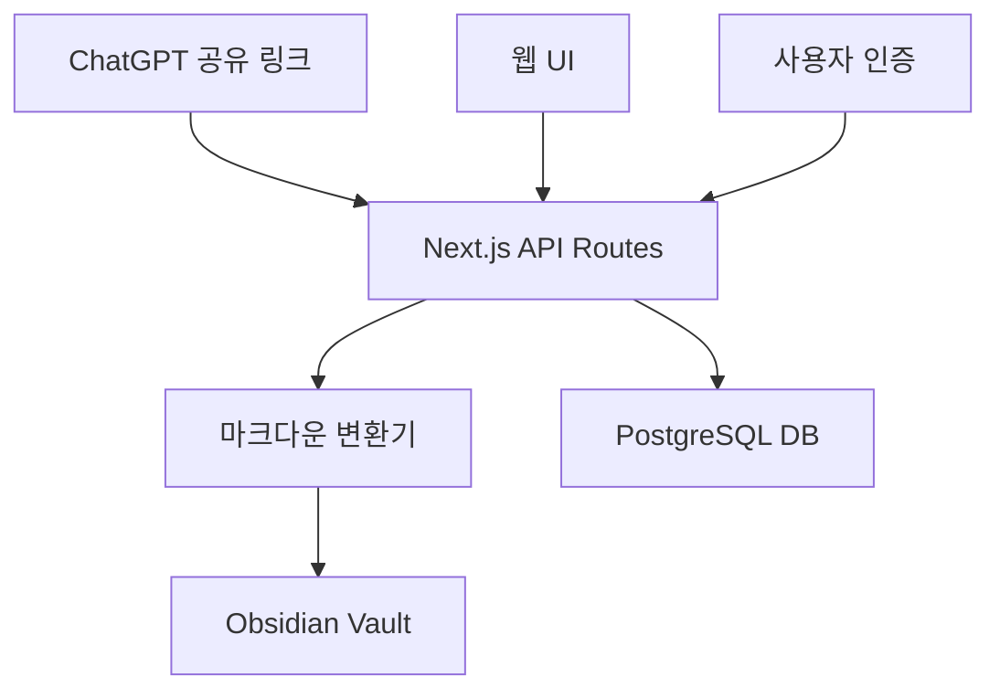

# 📌 프로젝트 개요
- **목표**: ChatGPT의 공유 기능을 활용하여 대화 내용을 Obsidian 기반의 PKM 시스템으로 자동 변환 및 저장
- **핵심 기능**: 
  1. ChatGPT 공유 링크 자동 파싱
  2. 마크다운 변환 및 메타데이터 추가
  3. Obsidian Vault 자동 저장
  4. 웹 기반 UI 제공

---

# 🧱 아키텍처 설계



---

# 🛠 기술 스택

## 1. 프론트엔드 (Next.js 14 + TypeScript)
- **프레임워크**: Next.js (App Router)
- **언어**: TypeScript
- **스타일링**: TailwindCSS
- **상태관리**: Zustand
- **UI 컴포넌트**: shadcn/ui
- **폼 관리**: React Hook Form + Zod

## 2. 백엔드 (Next.js API Routes)
- **API**: Next.js API Routes
- **인증**: NextAuth.js
- **데이터베이스**: PostgreSQL + Prisma
- **파일 시스템**: Node.js fs/promises
- **마크다운 처리**: unified + remark

## 3. 데이터베이스
- **ORM**: Prisma
- **스키마**:
  - User (사용자 정보)
  - Conversation (대화 기록)
  - Vault (Obsidian Vault 설정)

## 4. 배포
- **프론트엔드**: Vercel
- **데이터베이스**: Supabase
- **파일 저장**: 로컬 파일 시스템 (Obsidian Vault)

---

# 🚀 주요 기능 구현

## 1. ChatGPT 공유 링크 처리
```typescript
interface SharedLink {
  id: string;
  title: string;
  messages: Message[];
  metadata: {
    date: string;
    model: string;
    tags: string[];
  };
}
```

## 2. 마크다운 변환
```typescript
interface MarkdownContent {
  frontmatter: {
    title: string;
    date: string;
    tags: string[];
    source: string;
  };
  content: string;
}
```

## 3. Obsidian Vault 관리
```typescript
interface VaultConfig {
  path: string;
  templates: {
    conversation: string;
    summary: string;
  };
  tags: string[];
}
```

---

# 📁 프로젝트 구조

```
pmk-project/
├── src/
│   ├── app/
│   │   ├── api/
│   │   │   ├── auth/
│   │   │   ├── conversations/
│   │   │   └── vault/
│   │   ├── (auth)/
│   │   └── (dashboard)/
│   ├── components/
│   │   ├── ui/
│   │   ├── forms/
│   │   └── shared/
│   ├── lib/
│   │   ├── utils/
│   │   ├── validators/
│   │   └── constants/
│   └── types/
├── prisma/
│   └── schema.prisma
└── public/
```

---

# ✅ 구현 단계

## 1단계: 기본 기능 구현
- [x] Next.js 프로젝트 설정
- [x] 기본 UI 컴포넌트 구성
- [ ] ChatGPT 공유 링크 파싱
- [ ] 마크다운 변환 로직
- [ ] Obsidian Vault 저장

## 2단계: 사용자 기능
- [ ] NextAuth.js 인증 구현
- [ ] 사용자별 Vault 설정
- [ ] 대화 기록 관리
- [ ] 태그 시스템

## 3단계: 고급 기능
- [ ] 자동 태그 추출
- [ ] 대화 요약 생성
- [ ] 연관 대화 추천
- [ ] 검색 기능

---

# 🔒 보안 및 최적화

## 보안
- API 라우트 보호
- 파일 시스템 접근 제한
- 사용자별 Vault 격리

## 성능
- API 응답 캐싱
- 대용량 파일 처리 최적화
- 점진적 로딩

---

# 📈 확장 계획

## 1. 기능 확장
- 다중 Vault 지원
- 커스텀 템플릿
- 자동 백업

## 2. 통합
- Obsidian 플러그인
- VS Code 확장
- 모바일 앱

## 3. 협업 기능
- 공유 Vault
- 실시간 협업
- 권한 관리

---

# 🔚 마무리
- ChatGPT 공유 기능을 활용한 안정적인 데이터 수집
- 사용자 친화적인 UI/UX
- 확장 가능한 아키텍처
- 보안과 성능의 균형

